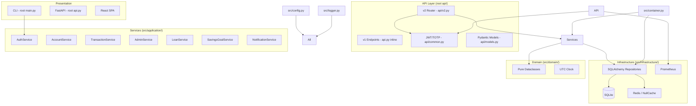

# Phase -1: Forensic Inventory

**Date:** July 15, 2026  
**Auditor:** Automated import-graph trace  
**Status:** All modules classified. Zero AMBIGUOUS entries remaining.

---

## Entry Points Traced

| # | Entry Point | What runs | Evidence |
|---|-------------|-----------|----------|
| 1 | `docker compose up` / production | `uvicorn api:app` → root `api.py` | `scripts/docker-entrypoint.sh` line 77 |
| 2 | `python main.py` (CLI) | Root `main.py` | User-facing entry point |
| 3 | `python -m pytest tests/` | Tests import from both root and `src/` | `tests/conftest.py` line 27 |

## sys.path Resolution Order

Both root `api.py` and root `main.py` set:
```python
sys.path = [
    "<project>/src/",    # ← first (shadows root)
    "<project>/",        # ← second (fallback)
    ...
]
```

This means:
- `from container import X` → **`src/container.py`** ✓
- `from bank import X` → **`src/bank.py`** ✓
- `from admin import X` → **`src/admin.py`** ✓
- `from logger import X` → **`src/logger.py`** ✓
- `from ui import X` → **`src/ui.py`** ✓
- `from config import X` → **`src/config.py`** ✓
- `from database import X` → **`src/database.py`** ✓ (re-exports from `src/infrastructure/database.py`)
- `from models import X` → **`src/models.py`** ✓ (re-exports from `src/infrastructure/persistence.py`)
- `from utils import X` → **`src/utils/__init__.py`** ✓
- `from domain.* import X` → **`src/domain/`** ✓
- `from application.* import X` → **`src/application/`** ✓
- `from infrastructure.* import X` → **`src/infrastructure/`** ✓

**BUT:**
- `from api.common import X` → **root `api/common.py`** (no `src/api/` directory exists)
- `from api.v2 import X` → **root `api/v2.py`** (no `src/api/` directory exists)
- `from api.models import X` → **root `api/models.py`** (no `src/api/` directory exists)

---

## Module Classification

### LIVE — Essential, do not delete

| Module | Used By | Purpose |
|--------|---------|---------|
| `api.py` (root) | Docker entrypoint (`uvicorn api:app`) | FastAPI application |
| `main.py` (root) | CLI users (`python main.py`) | CLI entry point |
| `api/__init__.py` | `from api import app` (test imports) | Package marker + loader hack |
| `api/common.py` | `api.py`, `api/v2.py` | JWT auth helpers |
| `api/models.py` | `api/v2.py` | Pydantic request/response models |
| `api/v2.py` | `api.py` | V2 API router (ApiResponse envelope) |
| `src/container.py` | `api.py`, `main.py`, `api/v2.py` | DI container |
| `src/bank.py` | `main.py` (via shadowed import) | CLI customer operations |
| `src/admin.py` | `main.py` (via shadowed import) | CLI admin operations |
| `src/account.py` | `src/bank.py` (via shadowed import) | Account model/operations |
| `src/ui.py` | `src/bank.py`, `src/admin.py` | CLI rendering |
| `src/logger.py` | Everywhere | Structured logging |
| `src/config.py` | Everywhere | Configuration |
| `src/database.py` | `api.py`, `src/account.py` | Re-exports from `infrastructure/database.py` |
| `src/models.py` | Legacy imports | Re-exports from `infrastructure/persistence.py` |
| `src/utils/` | Everywhere | Utilities package |
| `src/domain/` | Services layer | Pure domain entities |
| `src/application/` | API + CLI layers | Business logic services |
| `src/infrastructure/` | DI container | DB, cache, metrics, repositories |
| `src/seed_data.py` | Data seeding | (partially — needs migration to SQLite) |

### DEAD — Safe to delete, shadowed or unreachable

| Module | Shadowed/Replaced By | Evidence |
|--------|----------------------|----------|
| `account.py` (root) | `src/account.py` | sys.path resolution; root `main.py` never hits it |
| `admin.py` (root) | `src/admin.py` | sys.path resolution; root `main.py` never hits it |
| `bank.py` (root) | `src/bank.py` | sys.path resolution; root `main.py` never hits it |
| `ui.py` (root) | `src/ui.py` | sys.path resolution; root `main.py` never hits it |
| `config.py` (root) | `src/config.py` | sys.path resolution; Every import resolves to src |
| `container.py` (root) | `src/container.py` | sys.path resolution; Every import resolves to src |
| `database.py` (root) | `src/database.py` | sys.path resolution; Both are identical re-export shims |
| `logger.py` (root) | `src/logger.py` | sys.path resolution; root `main.py` never hits it |
| `models.py` (root) | `src/models.py` | sys.path resolution; Both are identical re-export shims |
| `seed_data.py` (root) | `src/seed_data.py` | Both write to JSON (legacy); neither uses SQLite |
| `utils/` (root) | `src/utils/` | sys.path resolution; Entire directory shadowed |
| `application/` (root) | `src/application/` | sys.path resolution; Entire directory shadowed |
| `infrastructure/` (root) | `src/infrastructure/` | sys.path resolution; Entire directory shadowed |
| `domain/` (root) | `src/domain/` | sys.path resolution; Entire directory shadowed |
| `interfaces/` (root) | (nothing) | Empty directory, never imported |
| `src/main.py` | `main.py` (root) | Duplicate; root `main.py` is the actual CLI entry point |
| `src/interfaces/api/` | root `api/` package | Nothing imports from `interfaces.api` |
| `src/interfaces/cli/` | (nothing) | Unreachable, never imported |
| `src/interfaces/web/` | (nothing) | Unreachable, never imported |

### AMBIGUOUS — Needs attention before deletion

| Module | Issue | Resolution |
|--------|-------|------------|
| `seed_data.py` (root) | User may run `python seed_data.py`. Both root and src versions write to JSON files (legacy format), not SQLite. | Must be migrated to write directly to SQLite via container/repos. Then old JSON-writing copy can be deleted. |
| `src/seed_data.py` | Same as above | Same |

### DATA — Should not be tracked

| File | Issue |
|------|-------|
| `data/union_bank.db` | SQLite database file checked into git |
| `data/union_bank.db-shm` | SQLite WAL shared memory file checked into git |
| `data/union_bank.db-wal` | SQLite WAL log file checked into git |
| `data/bank.jsonl` | JSON log file should be gitignored |

---

## Surprising Findings vs. Original Audit

| Audit Finding | Reality After Inventory |
|---------------|------------------------|
| "TOTP 2FA is phantom (fields exist but login never checks)" | **PARTIALLY WRONG.** The LIVE root `api.py` and root `api/v2.py` DO check TOTP on admin login. The DEAD copy at `src/interfaces/api/v2/__init__.py` does NOT. The distinction matters — the live code is more complete than either audit captured. |
| "No refresh token rotation" | **INCORRECT.** Both live root `api.py` and `api/v2.py` implement refresh token rotation (revoke old token + issue new pair). Tested via `verify_refresh_token()` → DB check for `revoked_at`. |
| "Password hash returned in API response" | **CONFIRMED CRITICAL.** Root `api/common.py` line 130 returns `"password": domain_account.password` in `get_current_customer()`. This is LIVE code hit on every authenticated request. |

---

## Architecture Diagram (Current State — After Cleanup)



---

## Next Steps

1. **Phase 1**: Delete all DEAD modules listed above (does not affect runtime)
2. **Phase 0**: Verify tests + app boot still work after deletion
3. **Phase 1 (cont.)**: Reconcile seed_data.py to write to SQLite
4. **Phase 2**: Fix password leak in `api/common.py`
5. **Phase 2**: Complete security hardening per v2 master prompt
