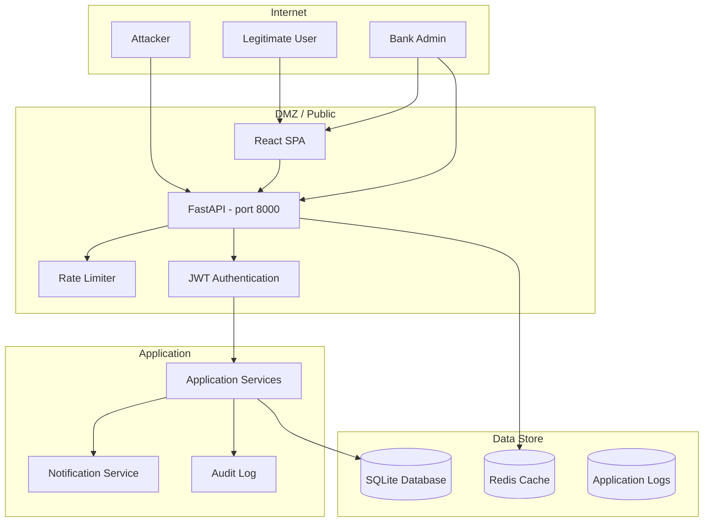

# Threat Model — Union Bank Management System

**Version:** 1.0  
**Date:** July 15, 2026  
**Scope:** FastAPI REST API + React SPA + SQLite backend  
**Classification:** Internal — do not distribute

---

## 1. Assets

| Asset | Description | Sensitivity | Impact if Compromised |
|-------|-------------|-------------|-----------------------|
| **Customer account credentials** | Account number + bcrypt password hash | Confidential | Unauthorized account access |
| **Account balances** | Current balance for each account | Confidential | Financial theft |
| **Transaction history** | Full history of deposits, withdrawals, transfers | Confidential | Privacy violation, financial analysis |
| **Admin credentials** | Admin username + bcrypt password + optional TOTP secret | Highly Confidential | Full system compromise |
| **JWT signing keys** | HS256 secret or RS256 private key | Highly Confidential | Token forgery |
| **Database file** | SQLite database with all customer data | Highly Confidential | Complete data breach |
| **Audit log** | Admin action history | Integrity-sensitive | Repudiation, compliance failure |

---

## 2. Trust Boundaries

**Trust boundary 1:** Internet → API (untrusted)  
**Trust boundary 2:** API → Application services (trusted)  
**Trust boundary 3:** Application services → Data stores (trusted)

---

## 3. Threats & Mitigations

### T1: Unauthorized Account Access via Credential Theft

| Attribute | Value |
|-----------|-------|
| **STRIDE** | Spoofing, Information Disclosure |
| **Risk** | **High** |
| **Likelihood** | Medium |
| **Impact** | High |

**Attack scenario:** Attacker obtains account credentials via phishing, database breach, or brute force.

**Mitigations:**
- bcrypt password hashing (PHC-recommended algorithm, cost factor 12+)
- Rate limiting: 5 failed attempts → 15-minute lockout
- Login attempts tracked per-account (not per-IP) in SQLite
- Account number is a random 10-digit number (not sequential, not user-chosen)
- **Password hash NOT included in API responses** (fixed in Phase 2 — was previously leaked via `get_current_customer()`)

**Residual risk:** Low. Rate limiting prevents brute force. bcrypt prevents hash cracking.

### T2: Token Forgery / Session Hijacking

| Attribute | Value |
|-----------|-------|
| **STRIDE** | Spoofing, Tampering |
| **Risk** | **High** |
| **Likelihood** | Low |
| **Impact** | High |

**Attack scenario:** Attacker obtains a valid JWT (via XSS, network interception, or database breach of refresh tokens).

**Mitigations:**
- Short-lived access tokens (15 minutes)
- Refresh token rotation (old token revoked on each refresh)
- DB-backed refresh tokens (revocable server-side, stored in SQLite)
- Token version tracking (password change invalidates all existing JWTs)
- JWT signed with HS256 (configurable RS256 for production)
- `check_same_thread=False` disabled on SQLite engine — token operations are thread-safe
- **No CSRF vulnerability** — Bearer token auth is inherently immune to traditional CSRF

**Residual risk:** Low. 15-minute access window + revocable refresh tokens limit blast radius.

### T3: Injection Attacks

| Attribute | Value |
|-----------|-------|
| **STRIDE** | Tampering, Information Disclosure |
| **Risk** | **High** |
| **Likelihood** | Low |
| **Impact** | High |

**Attack scenario:** SQL injection, command injection, or NoSQL injection via API parameters.

**Mitigations:**
- SQLAlchemy ORM used for all database queries (parameterized queries by default)
- No raw SQL query construction anywhere in the codebase
- Pydantic request models validate all input types and lengths
- Input validation for names, emails, phone numbers, and passwords
- No direct shell command execution from user input

**Residual risk:** Very low. ORM + Pydantic provide defense in depth.

### T4: Cross-Site Scripting (XSS)

| Attribute | Value |
|-----------|-------|
| **STRIDE** | Remote Code Execution |
| **Risk** | **Medium** |
| **Likelihood** | Medium |
| **Impact** | Medium |

**Attack scenario:** Attacker injects malicious JavaScript via account names, transaction descriptions, or other user-editable fields.

**Mitigations:**
- Content-Security-Policy header: `default-src 'self'; script-src 'self'; style-src 'self';`
- `X-XSS-Protection: 1; mode=block` header
- All user data rendered in React components is escaped by default (React JSX)
- Input validation restricts names to `[A-Za-z\s.]{2,50}` — no special characters

**Residual risk:** Low for API responses (JSON is not HTML). Low for React SPA (React escapes by default).

### T5: CSRF (Cross-Site Request Forgery)

| Attribute | Value |
|-----------|-------|
| **STRIDE** | Tampering |
| **Risk** | **Low** |
| **Likelihood** | Low |
| **Impact** | Medium |

**Attack scenario:** Attacker tricks authenticated user into performing state-changing operations via a malicious site.

**Mitigations:**
- Bearer token auth (not cookie-based) — inherently immune to CSRF
- `SameSite` cookie policy would apply if cookies were used (not applicable)
- CSRF middleware logs suspicious cross-origin requests (defense in depth)

**Residual risk:** Very low. Bearer token auth is a well-known CSRF mitigation.

### T6: Rate Limiting Bypass

| Attribute | Value |
|-----------|-------|
| **STRIDE** | Denial of Service |
| **Risk** | **Medium** |
| **Likelihood** | Medium |
| **Impact** | Medium |

**Attack scenario:** Attacker floods the API with requests to exhaust resources or brute-force credentials.

**Mitigations:**
- IP-based rate limiting via `slowapi` on all endpoints:
  - Login: 10/minute
  - Register: 5/minute
  - Deposit/Withdraw/Transfer: 10/minute
  - Profile/Statements: 30/minute
  - Admin operations: 10-30/minute
  - CSV export: 10/minute
- Account-aware rate limiting on login (per-account lockout after 5 failures)
- Rate limiting disabled in test mode to allow integration tests

**Residual risk:** Medium. SQLite write contention could become a bottleneck under high write load. No per-account rate limiting on transaction endpoints (deposit/withdraw/transfer use generic slowapi limits).

### T7: Database Compromise

| Attribute | Value |
|-----------|-------|
| **STRIDE** | Information Disclosure, Tampering |
| **Risk** | **Critical** |
| **Likelihood** | Low |
| **Impact** | Critical |

**Attack scenario:** Attacker gains access to the SQLite database file via file inclusion, backup exposure, or server compromise.

**Mitigations:**
- SQLite database uses WAL mode (crash-safe writes)
- Database file stored in a Docker volume (not world-readable)
- Server-side input validation prevents path traversal
- Passwords are bcrypt-hashed (computationally expensive to crack)
- TOTP secrets are stored in the same database (additional factor protects even if DB is breached)

**Residual risk:** High. SQLite has no native encryption, no access control, and no audit. A server compromise means total data exposure. **Mitigation:** PostgreSQL with encryption-at-rest for production.

### T8: TOTP 2FA Bypass

| Attribute | Value |
|-----------|-------|
| **STRIDE** | Spoofing |
| **Risk** | **Low** |
| **Likelihood** | Low |
| **Impact** | High |

**Attack scenario:** Attacker bypasses TOTP verification on admin login.

**Mitigations:**
- TOTP verification occurs AFTER password verification (defense in depth)
- `valid_window=1` allows ±30 second clock skew (industry standard)
- TOTP enforced on every admin login when enabled
- 2FA endpoints require current admin JWT to modify settings
- Disabling 2FA requires current TOTP code

**Residual risk:** Low. No known bypass exists for properly implemented TOTP.

### T9: Audit Log Tampering

| Attribute | Value |
|-----------|-------|
| **STRIDE** | Repudiation, Tampering |
| **Risk** | **Medium** |
| **Likelihood** | Low |
| **Impact** | Medium |

**Attack scenario:** Attacker deletes or modifies audit log entries to hide unauthorized actions.

**Mitigations:**
- Audit log is append-only (no update or delete operations exposed)
- Audit log entries stored in the same SQLite database (not separately protected)
- Each entry records: actor, action, target, details, IP address, timestamp, and reason

**Residual risk:** Medium. Audit log is in the same database as everything else. A DB compromise means audit log can be tampered with. **Mitigation:** Ship audit logs to a separate immutable store (e.g., AWS CloudTrail, Splunk).

### T10: Dependency Vulnerability

| Attribute | Value |
|-----------|-------|
| **STRIDE** | Remote Code Execution |
| **Risk** | **Medium** |
| **Likelihood** | Low |
| **Impact** | High |

**Attack scenario:** A known CVE in one of the project's Python dependencies is exploited.

**Mitigations:**
- `requirements.txt` uses `>=` version specifiers (not pinned — allows automatic security patches)
- Dependencies audited: bcrypt, PyJWT, FastAPI, SQLAlchemy, uvicorn
- Dead dependencies removed in Phase 1 (Flask, Flask-WTF, fpdf2 — see `docs/INVENTORY.md`)

**Residual risk:** Medium. No lockfile (`requirements.txt` uses `>=` not `==`). Builds are non-reproducible. A CVE in a dependency could be pulled in automatically.

---

## 4. Security Controls Summary

| Control | Category | Status |
|---------|----------|--------|
| bcrypt password hashing | Authentication | ✅ Implemented |
| JWT access tokens (15-min expiry) | Authentication | ✅ Implemented |
| JWT refresh tokens (7-day, revocable) | Authentication | ✅ Implemented |
| Token version invalidation | Authentication | ✅ Implemented |
| Refresh token rotation | Authentication | ✅ Implemented |
| Rate limiting (IP-based) | Anti-DoS | ✅ Implemented |
| Rate limiting (account-aware) | Anti-DoS | ✅ Implemented (login only) |
| TOTP 2FA for admin | Authentication | ✅ Implemented |
| Content-Security-Policy | XSS Prevention | ✅ Implemented |
| Security headers (HSTS, XFO, etc.) | Defense in Depth | ✅ Implemented |
| CSRF middleware | CSRF Prevention | ✅ Implemented (logging mode) |
| CORS restriction | Cross-Origin | ✅ Implemented |
| Input validation (Pydantic) | Injection Prevention | ✅ Implemented |
| SQLAlchemy ORM (parameterized queries) | SQL Injection | ✅ Implemented |
| Structured JSON logging | Observability | ✅ Implemented |
| Prometheus metrics | Monitoring | ⚠️ Defined but not fully wired |
| Password NOT in API responses | Data Leakage | ✅ Fixed (Phase 2) |
| All exceptions logged, not swallowed | Error Handling | ✅ Fixed (Phase 2) |
| Soft-delete for accounts | Data Integrity | ❌ Not implemented |
| Idempotency keys | Data Integrity | ❌ Not implemented |
| PostgreSQL (production DB) | Data at Rest | ❌ Not implemented (SQLite) |
| Database encryption at rest | Data at Rest | ❌ Not implemented |

---

## 5. Incident Response Procedures

### Suspected account compromise:
1. Freeze affected accounts via `/api/admin/accounts/{acc_no}/freeze`
2. Check audit log for unauthorized actions
3. Force password reset (admin action)
4. Investigate access patterns in structured logs

### Rate limiting triggered:
1. Check logs for the locked account
2. Determine if lockout was user error or attack
3. If attack: block IP at network level (if behind reverse proxy)
4. If user: wait for lockout to expire (15 minutes) or reset via admin

### Database integrity issue:
1. Stop the application
2. Restore from latest backup (if available)
3. Run integrity check: `PRAGMA integrity_check`
4. Investigate root cause via audit log and application logs

---

## 6. Assumptions & Dependencies

- **Docker** provides container-level isolation (not hardened beyond default settings)
- **No TLS termination** is provided by the application — assumes reverse proxy (nginx, Traefik) handles HTTPS
- **Redis** (if configured) runs on the same Docker network with no authentication
- **SQLite** provides file-level access control (Docker volume permissions)
- **No network segmentation** — all services are on the same Docker bridge network

---

## 7. Review Cadence

This threat model should be reviewed:
- After any major feature addition (loans, savings goals, new API endpoints)
- When the database is migrated from SQLite to PostgreSQL
- When authentication or authorization mechanisms change
- At least annually
